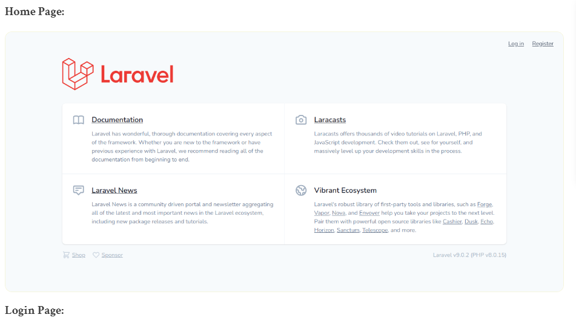
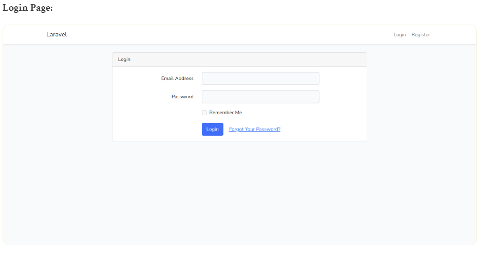
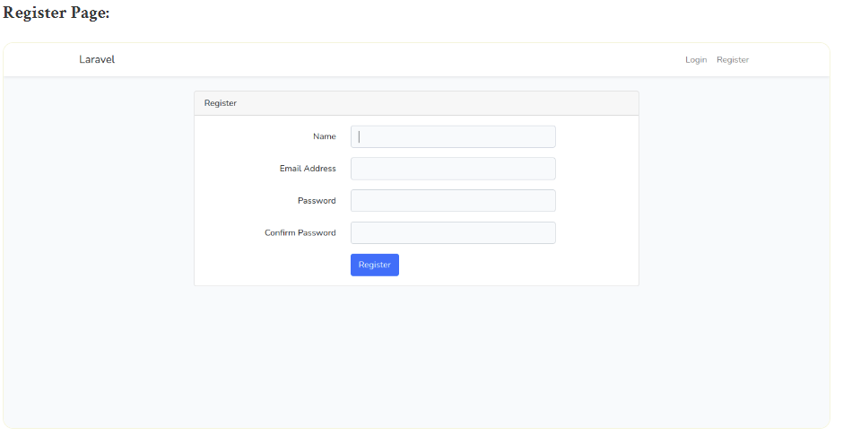
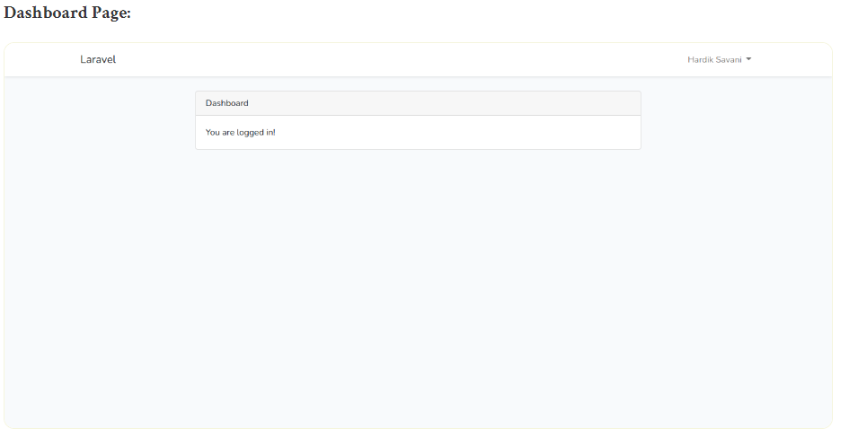

# laravel9_bootstrap_auth_scaffolding
## 1. Install Laravel 9 
```Dockerfile
composer create-project laravel/laravel laravel9_bootstrap_auth_scaffolding
```
## 2. Install Laravel UI
```Dockerfile
composer require laravel/ui
```
```Dockerfile
php artisan ui bootstrap
OR
php artisan ui bootstrap --auth
```
- command để cài đặt  npm
```Dockerfile
npm install && npm run dev
```
- chạy migration command
```Dockerfile
php artisan migrate
```
## 3.Run Laravel App:
```Dockerfile
php artisan serve
```
- Vào http://localhost:8000/





Chúng ta có thể sử dụng bootstrap 5 
```Dockerfile
<!doctype html>
<html>
<head>
    <!-- Scripts -->
    <script src="{{ asset('js/app.js') }}" defer></script>
   
    <!-- Styles -->
    <link href="{{ asset('css/app.css') }}" rel="stylesheet">
</head>
<body>
    <h1>This is example from ItSolutionStuff.com</h1>
</body>
</html>
```
